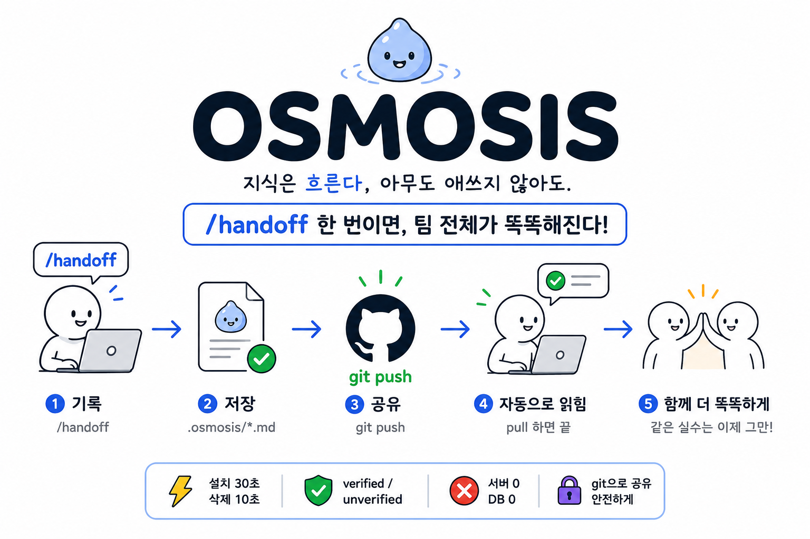

<div align="center">



</div>

---

## 🤔 뭐 하는 건데?

**Claude Code용 팀 공유 작업일지다.** 딱 두 가지를 한다:

1. ✍️ **기록** — 세션 끝에 `/handoff`를 치면, Claude가 이번 세션의 작업을
   요약해 repo 안 `.osmosis/`에 마크다운으로 남긴다.
   무엇을 하려 했고 / 어떻게 됐고(검증됐는지까지) / 뭘 시도하다 버렸는지.
2. 💉 **주입** — 팀원이 Claude Code를 켜면, 훅이 그 기록의 요약을
   세션 시작 시 자동으로 Claude에게 읽힌다. 같은 모듈을 누가 건드리는 중이면 경고까지.

기록은 그냥 git으로 공유된다. push하면 팀 전체, pull하면 내 것.
서버도 DB도 없다 — **repo 안의 마크다운 폴더 하나가 팀의 공유 기억이다.**
데일리 스크럼의 "어제 뭐 했고 뭐가 막혔다"를, 사람 대신 Claude들끼리 하는 셈이다.

```
나: /handoff ──▶ .osmosis/*.md ──▶ git push ──▶ 동료 pull ──▶ 동료의 Claude가 세션 시작 시 자동으로 읽음
```

## 왜 필요한데?

금요일, A가 테스트 모듈 만들고 퇴근. 사실 미완성인데, 그건 A의 Claude만 안다.
월요일, B: "그거 제가 구현할게요."

**주말 내내 아무도 몰랐다. A의 Claude는 알고 있었는데.**

각자의 Claude는 똑똑해지는데 기억은 각자 작업 공간에 갇혀 있다.
그래서 팀은 같은 버그를 두 번 잡고, 같은 막다른 길을 두 번 걷는다.

Osmosis는 그 기억을 git으로 흘려보낸다. push하면, 팀 전체의 Claude가 안다.

## 뭐가 달라지나

- 🔔 세션 켜는 순간 Claude가 먼저 말한다: **"그 모듈, 김OO이 미검증 상태로 열어둠"**
- ✅ `verified` / `unverified` 강제 구분 — **"했다"와 "됐다"는 다르다**
- 💣 시도했다 버린 접근이 기록으로 남는다 — **남이 밟은 지뢰, 나는 안 밟는다**
- 🪙 토큰 걱정 없음 — 세션당 주입 **2KB 고정**, 나머지는 필요할 때만 grep

## 🚀 설치 — Claude Code 안에서 두 줄

```
claude plugin marketplace add <ai-factory-git-url>/osmosis
/plugin install osmosis@slsi
```

끝. 커맨드와 훅이 자동 등록된다. 첫 `/handoff` 때 `.osmosis/`도 알아서 생긴다.
(플러그인이 막힌 환경이면 아래 [수동 설치](#수동-설치) 참고.)

## 🎮 사용법

```
/handoff     ← 세션 끝날 때. 이게 전부다.
/catchup     ← 세션 중 팀 현황·열린 작업 다시 보기 (필터: /catchup <모듈|키워드>)
```

시작할 땐 할 일 없다 — 훅이 팀 현황과 충돌 경고를 알아서 넣어준다.
빠른지 궁금하면 세션 로그를 보면 된다: `=== /OSMOSIS ⚡ 9ms ===`

### 실사용 시나리오 — 금요일의 A, 월요일의 B

> **🕕 금요일 18:00 · A**
>
> `table-parser`를 절반 만들다 테스트를 못 돌리고 퇴근. 세션 끝에 `/handoff` 한 번.
> Claude가 남기는 엔트리(요지):
>
> ```markdown
> module: src/table-parser · status: unverified   # "했다" ≠ "됐다"
> 결과: 파싱 로직 초안, 중첩 헤더 케이스 미검증
> 기각: 정규식 분리 → 중첩에서 깨져 폐기, 상태머신으로 선회
> ```
>
> feature 브랜치에 커밋·push하고 작업 공간을 정리한다.

> **🌅 월요일 09:00 · B**
>
> Claude Code를 켜자, 아무것도 안 했는데 세션 첫 화면에:
>
> ```
> [열린 작업 — 착수 전 확인]
> - src/table-parser : kim-a 의 미검증 엔트리 (osm-…ab12)
> ```
> ```
> B: table-parser 새로 구현할게
> Claude: 잠깐 — kim-a 가 지난주 이 모듈을 미검증으로 열어뒀어요.
>         정규식 분리는 이미 중첩에서 깨져 폐기됐고요. 이어받을까요?
> ```

**주말 내내 아무도 몰랐던 걸, B의 Claude가 세션 첫 줄에서 말해준다.**
B는 폐기된 정규식 삽질을 반복하지 않고, A의 상태머신 초안을 이어받는다.

> 💡 이 경고는 **머지를 안 기다린다.** A가 feature 브랜치에 push한 순간부터,
> 훅이 원격 브랜치 저널까지 스캔해 B에게 보인다.

## 🧹 관리 — 전부 Claude Code 명령으로

```
/plugin marketplace update osmosis   # ✨ 업데이트 — 팀 기록·설정 전부 보존
/plugin uninstall osmosis            # 🧼 제거 — 커맨드·훅 깨끗이 사라짐. 팀 기록(.osmosis/)은 남는다
```

기록까지 지우려면 `rm -rf .osmosis` 한 줄. 그게 전부다.
부담 없이 지울 수 있어야, 부담 없이 깔 수 있다.

## 수동 설치

플러그인 기능이 비활성화된 환경용. `install.sh`가 같은 일을 한다:

```bash
../osmosis/install.sh      # 설치 (멱등)
../osmosis/update.sh       # 갱신
../osmosis/uninstall.sh    # 제거 (--purge: 기록까지)
```

## FAQ

**언제 `/handoff` 를 치나?** — 세션 접기 직전. "남한테 인수인계할 게 생긴" 세션이면 친다.
시작할 땐 칠 게 없다 — 훅이 팀 현황·충돌 경고를 알아서 넣어준다.

**세션 도중에 현황을 다시 보려면?** — `/catchup`. 팀 현황과 열린 작업을 다시 보여준다.
좁히려면 `/catchup table-parser` 처럼 인자를 준다.

**`verified` / `unverified` 는 누가 정하나?** — Claude가 판단한다. 테스트를 돌려 통과했거나
커밋으로 확인된 것만 `verified`, 애매하면 `unverified`. "했다"와 "됐다"를 일부러 구분한다.

**토큰(비용) 안 늘어나나?** — 세션당 자동 주입은 **2KB 상한** 고정. 상세 기록은 필요할 때만
꺼내 본다. 저널이 아무리 쌓여도 매 세션 비용은 그대로다.

**이슈트래커랑 뭐가 다름?** — 그건 사람이 읽는 곳, 이건 Claude가 읽는 곳. 그래서 담당자
배정·우선순위 같은 건 일부러 뺐다. 효과 없으면 2주 뒤 지워라 — 10초다.

---

<div align="center">

**묻지 않아도 스며들고, 찾지 않아도 고여 있다. — Osmosis v0.1.0** · 문의: 조성광 · sk2011.cho@samsung.com · S/W혁신팀(S.LSI)

</div>
