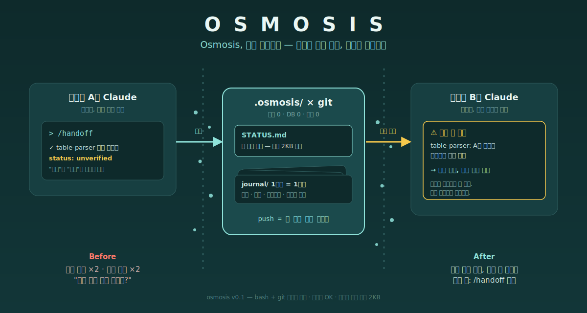

<div align="center">


# OSMOSIS

### Osmosis, 팀의 오아시스.

### 동료의 Claude는, 당신이 모르는 걸 이미 알고 있다.

**동료가 지난주에 밟은 지뢰, 오늘 당신이 또 밟는다. 그 반복을 여기서 끊는다.**

`서버 0` `DB 0` `데몬 0` `의존성: bash + git` `설치 30초` `삭제 10초`

</div>

---

## 🤔 뭐 하는 건데?

**Claude Code용 팀 공유 작업일지다.** 딱 두 가지를 한다:

1. ✍️ **기록** — 세션 끝에 `/handoff`를 치면, Claude가 이번 세션의 작업을
   요약해 repo 안 `.osmosis/`에 마크다운으로 남긴다.
   무엇을 하려 했고 / 어떻게 됐고(검증됐는지까지) / 뭘 시도하다 버렸는지.
2. 💉 **주입** — 팀원이 Claude Code를 켜면, 훅이 그 기록의 요약을
   세션 시작 시 자동으로 Claude에게 읽힌다. 같은 모듈을 누가 건드리는 중이면 경고까지.

기록은 그냥 git으로 공유된다. push하면 팀 전체, pull하면 내 것.
서버도 DB도 없다 — **repo 안의 마크다운 폴더 하나가 팀의 공유 기억이다.**
데일리 스크럼의 "어제 뭐 했고 뭐가 막혔다"를, 사람 대신 Claude들끼리 하는 셈이다.

```
나: /handoff ──▶ .osmosis/*.md ──▶ git push ──▶ 동료 pull ──▶ 동료의 Claude가 세션 시작 시 자동으로 읽음
```

## 왜 필요한데?

금요일, A가 테스트 모듈 만들고 퇴근. 사실 미완성인데, 그건 A의 Claude만 안다.
월요일, B: "그거 제가 구현할게요."

**주말 내내 아무도 몰랐다. A의 Claude는 알고 있었는데.**

각자의 Claude는 똑똑해지는데 기억은 각자 노트북에 갇혀 있다.
그래서 팀은 같은 버그를 두 번 잡고, 같은 막다른 길을 두 번 걷는다.

Osmosis는 그 기억을 git으로 흘려보낸다. push하면, 팀 전체의 Claude가 안다.

## 뭐가 달라지나

- 🔔 세션 켜는 순간 Claude가 먼저 말한다: **"그 모듈, 김OO이 미검증 상태로 열어둠"**
- ✅ `verified` / `unverified` 강제 구분 — **"했다"와 "됐다"는 다르다**
- 💣 시도했다 버린 접근이 기록으로 남는다 — **남이 밟은 지뢰, 나는 안 밟는다**
- 🪙 토큰 걱정 없음 — 세션당 주입 **2KB 고정**, 나머지는 필요할 때만 grep

## 🚀 설치 — Claude Code 안에서 두 줄

```
claude plugin marketplace add <ai-factory-git-url>/osmosis
/plugin install osmosis@osmosis
```

끝. 커맨드와 훅이 자동 등록된다. 첫 `/handoff` 때 `.osmosis/`도 알아서 생긴다.
(플러그인이 막힌 환경이면 아래 [수동 설치](#수동-설치) 참고.)

## 🎮 사용법

```
/handoff     ← 세션 끝날 때. 이게 전부다.
```

시작할 땐 할 일 없다 — 훅이 팀 현황과 충돌 경고를 알아서 넣어준다.
빠른지 궁금하면 세션 로그를 보면 된다: `=== /OSMOSIS ⚡ 9ms ===`

## 🧹 관리 — 전부 Claude Code 명령으로

```
/plugin marketplace update osmosis   # ✨ 업데이트 — 팀 기록·설정 전부 보존
/plugin uninstall osmosis            # 🧼 제거 — 커맨드·훅 깨끗이 사라짐. 팀 기록(.osmosis/)은 남는다
```

기록까지 지우려면 `rm -rf .osmosis` 한 줄. 그게 전부다.
부담 없이 지울 수 있어야, 부담 없이 깔 수 있다.

## 원리 (20초)



```
.osmosis/
├── STATUS.md       팀 현황 2KB — 매 세션 자동 주입
└── journal/이름/    1작업 = 1파일 — merge conflict 원천 차단
```

브랜치도 고려돼 있다: 기록은 작업 브랜치에 커밋되고 PR 머지 때 main으로 합류하지만,
**충돌 경고는 머지를 기다리지 않는다** — 훅이 원격의 다른 브랜치 저널까지 스캔하므로,
동료가 feature 브랜치에 push한 순간부터 보인다. (push 전 로컬 작업만은 물리적으로 불가.)

frontmatter(id·module·status·verified_by)는 나중에 200명 규모·벡터DB로
가더라도 그대로 승격되게 설계했다. 지금 4명이어도 데이터는 안 버린다.

## 수동 설치

플러그인 기능이 비활성화된 환경용. `install.sh`가 같은 일을 한다:

```bash
../osmosis/install.sh      # 설치 (멱등)
../osmosis/update.sh       # 갱신
../osmosis/uninstall.sh    # 제거 (--purge: 기록까지)
```

## FAQ

**또 문서화 시키는 거 아님?** — 쓰는 건 Claude다. 당신은 `/handoff` 일곱 글자만 친다.
**이슈트래커랑 뭐가 다름?** — 그건 사람이 읽는 곳, 이건 Claude가 읽는 곳. 그래서 담당자 배정·우선순위 같은 건 일부러 뺐다.
**효과 없으면?** — 2주 뒤 `⚠ 미검증 방치` 숫자가 안 줄면 지워라. 10초다.

---

<div align="center">

**묻지 않아도 스며들고, 찾지 않아도 고여 있다. — Osmosis v0.1.0** · 문의: RAG평가플랫폼팀

</div>
